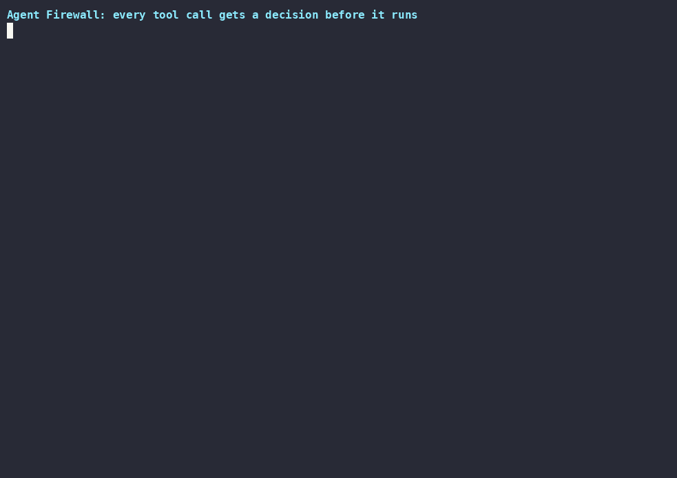

# Agent Firewall

> Local, zero-dependency policy enforcement for AI-agent tool calls: allow, hold, or block before the tool runs.

<p align="center"></p>

Watch the full demo: [demo.mp4](assets/demo/demo.mp4)

## Why this exists

LLM agents get real tools (filesystem, shell, email, browsers), and tool-calling frameworks often execute what the model proposes without checking it first. Agent Firewall is a policy engine that sits between an agent and its tools and answers one question per call: allow, hold, or block before the tool runs.

## What it does

- **Ordered policy rules**: `allow` / `require_approval` / `block` matched by tool name and bound arguments; first match wins, `block` is the default fallback.
- **Typed argument matchers**: URL host/port/path, filesystem path, email domain, HTTP method, numeric range, SQL operation, and command argv patterns instead of string globs. See [docs/ARGUMENT_MATCHERS.md](docs/ARGUMENT_MATCHERS.md).
- **Budgets and caps**: per-run call and cost limits, plus per-tool and identical-call repetition caps; capacity is reserved before anything runs.
- **Human approval**: a Python callback, or terminal and browser prompts, decide `require_approval` calls.
- **MCP stdio proxy and audit trail**: wrap any local MCP server; blocked or malformed calls are answered with a JSON-RPC error and never forwarded, stalled servers fail closed, and append-only JSONL audit records keep arguments off disk by default (`hash`, `redacted`, and `full` modes trade utility against exposure).

## Architecture

```
          agent tool call
    (CLI | Python API | MCP proxy)
                  │
                  ▼
          Policy.evaluate()
            bind arguments
          │                │
          ▼                ▼
      ordered rules    typed matchers
      (tool + args)   (url, path, ...)
          │                │
          └────────┬───────┘
                   ▼
        decision: allow / require_approval / block
              + reason + rule index
          │                    │
          ▼                    ▼
  budgets & counters    audit record
  (SQLite state,       (JSONL,
   fail-closed writes)  arguments hashed)
```

Module map: `cli.py` (commands) → `policy.py` + `matchers.py` (evaluation) → `models.py` (decision model) → `state.py` + `audit.py` (persistence) → `mcp_proxy.py` + `jsonrpc.py` (MCP), with `approvals.py`, `dashboard.py`, `lint.py`, `explain.py`, `doctor.py`, and `benchmark.py` around the core.

## Quick start

```bash
python3 -m venv .venv && .venv/bin/pip install -e .
.venv/bin/agent-firewall check --policy examples/policy.json \
  --tool database.query --arguments '{"query":"SELECT 1"}' --format text
```

Output: `allow  database.query` with the matching rule reason. Exit codes for `check`: `0` allow, `3` require_approval, `4` block, `2` invalid input; `policy lint`, `replay` with missed scenarios, and `doctor` failures exit `1`; `benchmark` with failed thresholds exits `5`. The Python API guards real functions the same way: `Firewall.from_policy_file(...)` plus `firewall.wrap("email.send", send_email)` in [examples/wrap_tool.py](examples/wrap_tool.py); a denial raises `ToolCallBlocked`, not a crash.

## Guard an MCP server

Wrap any stdio MCP server; only its `tools/call` traffic passes through the policy:

```bash
agent-firewall mcp --policy examples/policy.json \
  --audit firewall-audit.jsonl --state firewall.db \
  --approve-web \
  -- node server.js
```

Held (`require_approval`) calls wait for a decision in the local dashboard. The proxy prints the exact command to start it; the dashboard startup banner echoes its URL and approval token:

```bash
agent-firewall dashboard --policy examples/policy.json --state firewall.db
# Agent Firewall dashboard: http://127.0.0.1:8787
# Agent Firewall dashboard token: ...
```

Approve or deny in the browser, or script it with the token against `POST /api/approvals/<call_id>`. The proxy logs lifecycle events (spawned pid, child exit) and held-call guidance on stderr.

## See it stop real attacks

`scripts/demo/attack_demo.py` runs a deliberately vulnerable MCP server behind the proxy and walks six live scenarios in under a second: an allowed query, an octal-encoding SSRF attempt, stacked SQL hiding a DROP, duplicate-key frame smuggling, a held email approved end-to-end through the dashboard API, and a runaway loop cut off by the identical-call budget:

```bash
.venv/bin/python scripts/demo/attack_demo.py
```

## Demo

The recording replays [examples/demo_policy.json](examples/demo_policy.json) against three proposed calls (one allowed, one held for approval, one blocked), each with the policy reason:

```bash
agent-firewall check --policy examples/demo_policy.json \
  --tool browser.navigate --arguments '{"url":"http://169.254.169.254/"}' --format text
```

Regenerate the recording with `./scripts/demo/record.sh` (requires asciinema, agg, and ffmpeg); the session is scripted in [scripts/demo/demo_body.sh](scripts/demo/demo_body.sh) and runs offline from the repo root.

## Technical decisions

- **Type-strict argument matching.** Exact-value rules compare with type identity: the boolean `true` does not match `1`, and `500` does not match `500.0`. Tool arguments arrive as numbers, floats, booleans, and stringified values; a lenient matcher would accept calls the policy author never approved.
- **SSRF-hardened private-network classification.** The `url` matcher's `deny_private_networks` flag classifies literal IPs only, but covers the encodings resolvers still accept (`127.1`, `2130706433`, `0x7f000001`, `017700000001`-style octal, leading zeros, IPv6 zone ids), so rewriting an address cannot sidestep the gate. Hostnames are deliberately not resolved (see Limitations).
- **Fail-closed MCP proxy.** Every client line must be a decodable JSON object with no duplicate keys before it is forwarded. Undecodable, non-object, duplicate-key, and batch lines are answered with a JSON-RPC error and never reach the wrapped server, so a lenient server cannot execute a call the policy never evaluated.
- **Depth-bounded JSON processing.** Every place agent-controlled data is parsed or serialized (audit records, fingerprints, CLI, proxy, policy loading) bounds nesting at 64 levels, and policy and benchmark files reject duplicate JSON keys at load time. Pathological input can neither crash the process with `RecursionError` nor silently widen enforcement through a duplicate-key typo.

## Validation

486 tests, including the security-hardening suite (SSRF address encodings, duplicate-key poisoning, recursion-depth DoS, MCP fail-closed boundaries), pass in CI; ruff and strict mypy are clean:

```bash
.venv/bin/python -m pytest tests -q --no-header   # 486 passed, 117 subtests passed
```

[](https://github.com/haseebraza715/agent-firewall/actions/workflows/ci.yml)

## Limitations

- `deny_private_networks` classifies literal IPs only; it does not resolve DNS, so a hostname that points at a private address is not caught by that gate.
- An enforcement point, not a sandbox: tool implementations still need least-privilege credentials and OS isolation. See [docs/THREAT_MODEL.md](docs/THREAT_MODEL.md) for the exact boundary.
- No prompt-injection detection, and budgets are per-host — a coordinated multi-host agent can exceed them.
- Matcher coverage is the documented set; anything else must be expressed as tool-name rules or exact/glob values.
- The benchmark results in [benchmarks/v1](benchmarks/v1/README.md) are internally curated and labeled — selected replay coverage, not independent or externally validated safety results.
- Alpha: the latest release is the only supported version; see [SECURITY.md](SECURITY.md). License: MIT ([LICENSE](LICENSE)).
